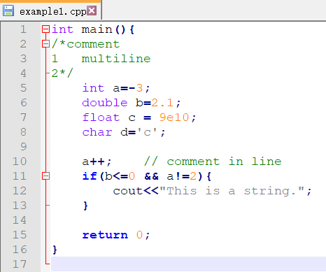
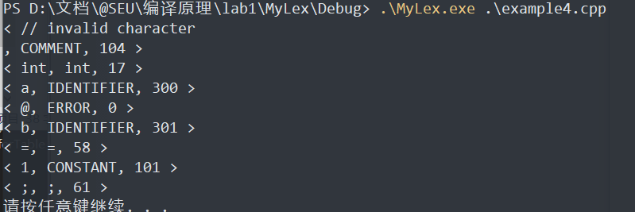

# Lexical Analyzer Programming实验报告

## a. 实验目的

根据课程学习内容，编写一个词法分析程序，加深对词法分析原理的理解。  

## b. 实验内容

1. 输入字符流，正规表达式
2. 输出token序列
3. 自行定义单词的类型
4. 进行适当的错误处理

## c. 实验方案

1. 自己定义一些正则表达式
2. 将REs转化为NFAs
3. 将多个NFA合并为一个NFA
4. 将NFA转化为最小化的DFA
5. 基于DFA$_0$进行编程

## d. 实验假设

假设程序输入为一段C++代码

词法类型有：常数、字符、字符串、标识符、保留字、注释。

## e. FA设计

> REs->NFAs->NFA->DFA

### 1. 常数

##### 规则

> 整数，小数，科学计数法
>
> 0	0.1	2e10	-6e-1 .5

##### RE

```
[0-9][0-9]*(.[0-9][0-9]*)?(e[+,-]?[0-9]*)?
```

##### NFA


### 2. 标识符

##### 规则

> 首位是字母或下划线，其余可以是数字或字母

##### RE

```
[A-z,_][A-z,_,0-9]*
```

##### NFA


### 3. 保留字

##### 规则

> 涵盖的保留字：
>
> case, char, const, continue, default, else, enum, float, for, int, if...

##### RE

    case|char|const|continue|default|else|enum|float|for|int|if

##### NFA


### 4. 字符

##### 规则

> 单引号内有且仅有一个字符，可以是转义字符

##### RE

```
'[^\']|(\[*])'
```

##### NFA


### 5. 字符串

##### 规则

> 双引号内有零个或多个字符，可以是转义字符

##### RE

```
"([^\"]|(\[*]))*"
```

##### NFA


### 6. 注释

##### 规则

> // 之后的本行
>
> /* */ 之间，可跨多行

##### RE

```
/(/[*]*\n | * ([^*]|(\*[^/]))* 
```

##### NFA


#### 合并NFA并构造最小化DFA


## f. 数据结构

### 状态转换表

将上述DFA转化为状态转换表，便于后续编码实现。


表中行为状态编号，列为字符编号，表中数字表示下一个跳转状态，-1表示结束，随后查询终结符列表识别类别或是出错。

name列为类别名称，code为内部编码，为0即表示出错。

### 对应代码中的实现

- DFA状态转换表

  

- 终结符表

  

## g. 核心算法

- `scanner`函数用于逐字扫描源程序

  

  > 初始化state=0，在`while`循环中根据DFA状态转换表跳转，直到终态或出错。
  
- `getAction`函数将字符转为动作编号

  

- `getToken`函数用于判断终态，确定单词类型或报错

  

## h. 测试用例

1. example1

   - input

   

   - output

     > 成功识别了单行、多行注释，科学计数，字符，多字节运算符等情况

     

2. example2

   - input

     

   - output

     > 识别出了字符错误，并进行了报错

     

3. example3

   - input

     

   - output

     > 识别出了引号不匹配的错误，并进行了报错

     

4. example4

   - input

     

   - output

     > 识别出了非法字符，并进行了报错

     

## i. 问题及解决

1. 一开始没有考虑到双符号运算符，导致`+=`会被识别为`+`号和`=`号两个符号，解决方法就是对每个双符号运算符设计FA
2. 由于状态较多采用switch case 的方式编写较为繁琐，因此我构造了状态转换表，采用二维数组的方式存储，提高了编码效率，但可读性下降了
3. 异常处理设计的不是很完善，某些情况无法识别

## j. 实验感想

通过本次实验，我更深入地理解了词法分析程序的设计思路。知道了如何根据DFA设计程序，将理论知识应用到实际程序中。本次实验也存在诸多不足，由于采用的第二种思路，大部分工作均需要手动完成，较为繁琐，且代码扩展性较差，并对保留字数量进行了大量简化。但由于采用了构造状态转换表的方式，主程序部分实现较为简单，便于后续采用思路三自动化生成词法分析程序。

---

# 附：项目说明

## 编译环境

vs2015

## 目录结构

```sh
D:.
│  trans.csv	# 手动推导出的状态转换表
│  transTable.xlsx
│
├─MyLex
  │
  ├─Debug
  │      example1.cpp	# 测试输入
  │      example2.cpp
  │      example3.cpp
  │      example4.cpp
  │      MyLex.exe	# 可执行程序
  │      output1.txt	# 测试输出
  │      output2.txt
  │      output3.txt
  │      output4.txt
  │
  └─MyLex
      │  lex.cpp	# 主程序
      └─  out.txt
```

## 运行方法

进入debug目录

```sh
cd ./MyLex/Debug/
```

`MyLex.exe`为可执行程序，启动方式如下：

```sh
# 参数为待分析源程序
.\MyLex.exe .\example1.cpp
# 若要输出到文件请使用管道命令
.\MyLex.exe .\example1.cpp > out.txt
```

