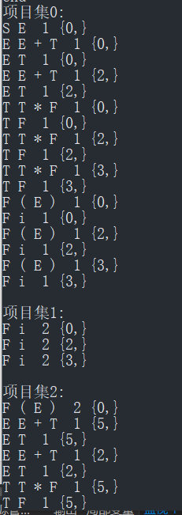
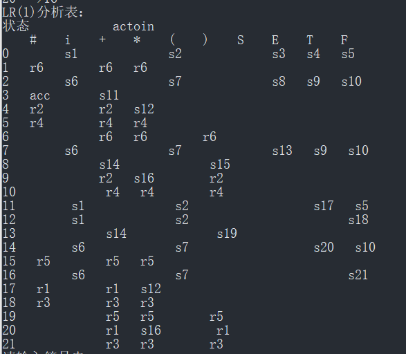
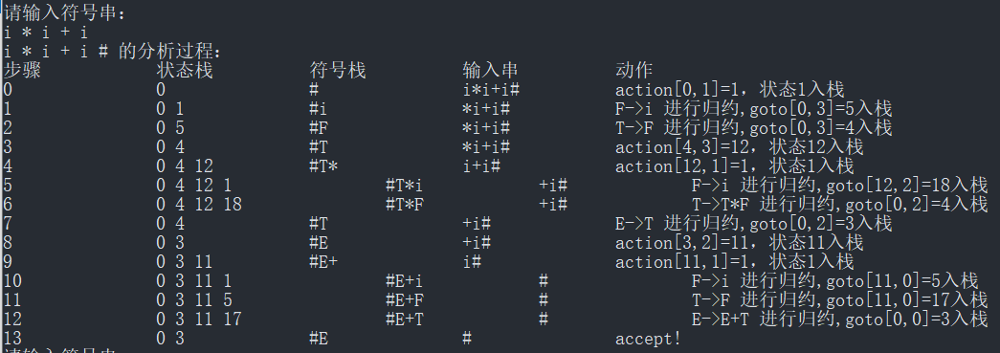
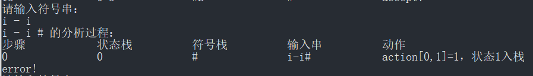
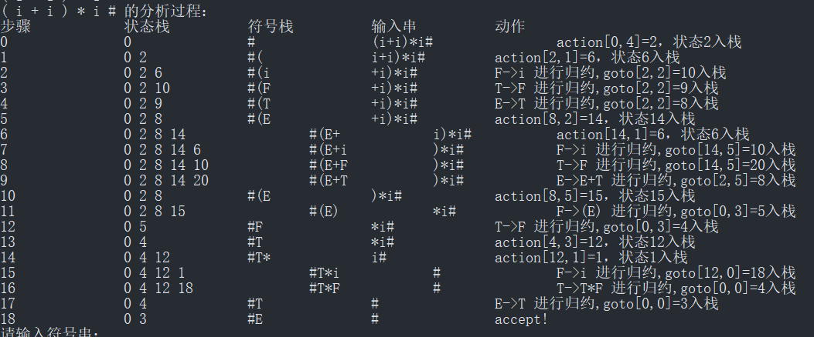
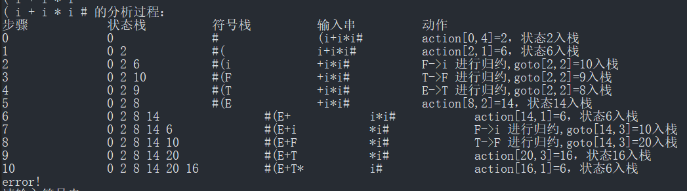

# Syntax Parser Programming 实验报告

## a. 实验目的

根据课程学习内容，编写一个语法分析程序，加深对语法分析原理的理解。  

## b. 实验内容

1. 输入字符流，CFG
2. 输出推导序列（自顶而下）或归约序列（自底向上）
3. 自行定义句子的类型
4. 进行适当的错误处理

## c. 实验方案

1. 自己定义CFG，输入产生式
2. 编写程序根据CFG构造LR(1)项集族
3. 构造LR(1)分析表
4. 输入Token序列，根据LR分析表输出归约过程

## d. 实验假设

假设输入文法符合LR(1)文法，且不存在需要添加附加条件才能解决的冲突。

## e. FA设计

1. 根据输入的文法，对每个产生式构造LR(1)项
2. 对每一项求闭包，构造项目集
3. 构造项目集族（采用链式前向星图存储）

> 本部分算法详见[g.核心算法](#g.核心算法)

## f. 数据结构

1. 产生式、终结符、非终结符

   ```c++
   unordered_map<string, int>ch_to_num;	// 字符到数字转换表
   vector<string> num_to_ch;          // 数字到字符转换表
   vector<vector<string>>productions;        //产生式	[ [左部, 右部1,右部2...],[...]...]   
   ```

2. LR(1)项

   ```c++
   // LR(1) 项
   struct item        
   {
   	int pid=0;			// 产生式编号
   	int dotPos=1;		//.的位置
   	unordered_set<int> fst;		//first集
   };
   ```

3. LR(1)项目集族

   采用**链式前向星**方式存储DFA图

   ```c++
   // DFA 边
   struct edge
   {
   	int next;		//下一条边的存储下标
   	int to;		//这条边的终点
   	int w;
   };
   
   vector<vector<item> >itemSetCollection;             //项目集族
   vector<edge> edges;		// DFA 边集
   unordered_map<int, int> head;    // head[i]表示以i为起点的第一条边
   ```

   ```c++
   //构造边
   void addEdge(int from, int to, int w)
   {
   	int f = head.count(from) == 0 ? -1 : head[from];
   	edge e = { f,to,w };
   	edges.push_back(e);
   	head[from] = edges.size()-1;
   }
   ```

4. LR(1)分析表

   ```c++
   vector<vector<int>> table;		 //预测分析表 -1
   vector<vector<int>> tb_s_r;        //是移进项还是规约项,-1,-2
   ```

## g. 核心算法

1. 求符号的first集

   ```c++
   // 求符号的FIRST集（当前符号，产生式编号）
   void getfirst(int nv, int nump)
   {
   	int fch = ch_to_num[productions[nump][1]];  //产生式推出来的首符
   	if (fch <= e_idx)first[nv].insert(fch);  //是终结符
   	else
   	{
   		for (int i = 0;i<relate_prods[fch].size();i++)
   		{
   			if (productions[nump][0] == productions[nump][1])continue;	//跳过左递归
   			getfirst(fch, relate_prods[fch][i]);
   		}
   
   		first[nv].insert(first[fch].begin(), first[fch].end());       // 加上fch的first集
   	}
   }
   
   // 构造每个符号的first集
   void gen_firstSet()
   {
   	first = vector<unordered_set<int>>(num+1);
   	for (int i = 1;i <= e_idx;i++)             //    终结符first集是自己
   	{
   		first[i].insert(i);
   	}
   	for (int i = 0;i<productions.size();i++)
   	{
   		if (productions[i][0] == productions[i][1])continue; // 跳过左递归的产生式
   		int nv = ch_to_num[productions[i][0]];
   		getfirst(nv, i);
   	}
   }
   ```

2. 使用BFS算法，构造DFA item

   ```c++
   // 获取LR项的闭包，构造项目集，BFS
   vector<item> getClosure(item &t)           
   {
   	vector<item> temp;
   	temp.push_back(t);
   	queue<item> q;
   	q.push(t);
   	while (!q.empty())
   	{
   		item cur = q.front();
   		q.pop();
   		if (cur.dotPos == productions[cur.pid].size())          // . 位于最后
   			continue;
   		int tt = ch_to_num[productions[cur.pid][cur.dotPos]];       // . 之后的符号
   		if (tt <= e_idx)   continue;                  //若是终结符，则不必找了
   		for (int i = 0;i<relate_prods[tt].size();i++)         //对应产生式的编号
   		{
   			item c;
   			c.pid = relate_prods[tt][i];
   			if (productions[cur.pid].size() - cur.dotPos == 1) // . 位于最后
   				c.fst += cur.fst;
   			else
   			{
   				int tttnum = ch_to_num[productions[cur.pid][cur.dotPos + 1]];
   				c.fst.insert(first[tttnum].begin(), first[tttnum].end());
   			}
   			if (!isItemInSet(c, temp))           // 查重
   			{
   				q.push(c);
   				temp.push_back(c);
   			}
   		}
   	}
   	return temp;
   }
   ```

3. 使用BFS算法，构造DFA

   ```c++
   // 生成项目集族
   void gen_itemSetCollection()            
   {
   	vector<item>temp;
   	item t;
   	t.fst.insert(0);
   	temp = getClosure(t);
   	queue<vector<item> >q;        // BFS
   	q.push(temp);
   	itemSetCollection.push_back(temp);
   	while (!q.empty())
   	{
   		vector<item> cur = q.front();
   		q.pop();
   		for (int i = 1;i <= num;i++)     //所有符号
   		{
   			if (i == e_idx)continue;      // 跳过空字
   			vector<item> temp;
   			for (int j = 0;j<cur.size();j++)     //该项目集中的所有项目
   			{
   				if (cur[j].dotPos == productions[cur[j].pid].size())continue;  //是规约项
   				int tt = ch_to_num[productions[cur[j].pid][cur[j].dotPos]];
   				if (tt == i)                                          // 下个符号为i
   				{
   					item it;
   					it.fst = cur[j].fst;
   					it.dotPos = cur[j].dotPos + 1;
   					it.pid = cur[j].pid;
   					temp = combineSet(temp, getClosure(it));
   				}
   			}
   			if (temp.size() == 0)continue;             // 项集为空
   			int numcur = findSetInCollection(cur, itemSetCollection);   //当前节点标号
   			int tttnum = findSetInCollection(temp, itemSetCollection);  //新目标标号
   			if (tttnum == -1)                    //新的项目集
   			{
   				itemSetCollection.push_back(temp);
   				q.push(temp);
   				addEdge(numcur, itemSetCollection.size() - 1, i);   //添加边，权为读入的符号
   			}
   			else                             //老的项目集
   			{
   				addEdge(numcur, tttnum, i);
   			}
   		}
   	}
   }
   
   ```

## h. 测试用例

### 测试用例1

- 输入非终结符

  ```
  i + * ( )
  ```

- 输入终结符

  ```
  S E T F
  ```

- 输入产生式

  ```
  S->E
  E->E + T
  E->T
  T->T * F
  T->F
  F->( E )
  F->i
  ```

- 输出项目集族

  

- 输出LR(1)预测分析表

  

- 输入待分析Token串

  1. `i * i + i`

     

     分析成功

  2. `i - i`

     

     未知符号`-`，分析失败

  3. `( i + i ) * i`

     

     分析成功

  4. `( i + i * i`

     

     括号不配对，分析失败

## i. 问题及解决

1. 目前仅测试了几组简单的文法，没有设计类似真实编程语言的文法。
2. 本程序对文法规整性要求较高，不能使用附加条件解决冲突，还有很大的改进空间。
3. 在文法较为复杂的情况下，生成分析表的速度很慢，后续可以优化下算法。


## j. 实验感想

通过本次实验，我更深入地理解了LR分析器的设计思路，让我更加深刻的体会到语法分析的具体过程与自下而上的分析方法的具体细节。实验一开始我并不太明白语法分析程序的设计思路，我参考了网上了一些博客后，学会了如何用算法将作业中手动推导出的LR分析表用程序来表示推导出来。由于LR分析表较为复杂，程序查错、调试较为困难，在这方面我花费了大量的时间。因而没有设计更完善的文法进行测试。

# 附：项目说明

## 编译环境

vs2015

## 目录结构

```sh
D:.
└─SyntaxParser
    ├─Release
    │      input1.txt	# 测试输入
    │      input2.txt
    │      out1.txt		# 测试输出
    │      SyntaxParser.exe	# 可执行程序
    │
    └─SyntaxParser
        │  Edge.h
        │  Item.h
        │  parser.cpp	# 主程序
        │  Utils.h
```

## 运行方法

**进入release目录**

```sh
cd .\SyntaxParser\Release\
```

`SyntaxParser.exe`为可执行程序，可直接双击启动。

**分别输入**

> 终结符集，非终结符集，所有产生式
> （以上可直接复制粘贴 input.txt 中的内容，一次性输入）
>
> 示例如下：

```
请输入终结符集：
i + * ( )
请输入非终结符集：
S E T F
输入所有产生式（空字用‘@’表示）,以‘end’结束:
S->E
E->E + T
E->T
T->T * F
T->F
F->( E )
F->i
end
```

此时将显示LR(1)预测分析表，可继续输入token序列进行分析。

